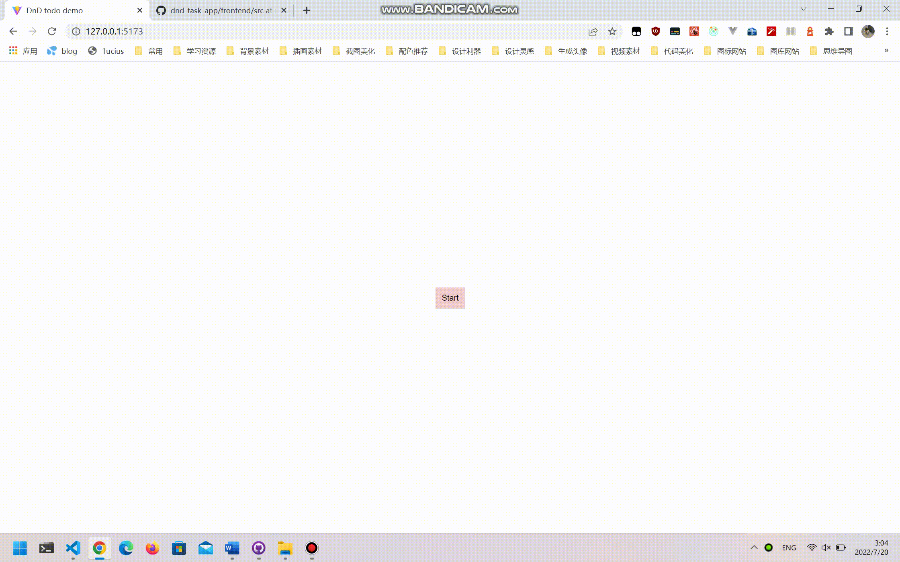

# dnd-task-app

demo for interview

## usage

backend folder is missing .env file, but you can visit http://lucius.top:5000 to see the hello api.

in frontend folder,

```sh
npm i
npm run dev
```

test account:
username:`lucius`
password:`lucius`

## highlights

1. in backend project, i write my own middleware for auth router.
2. redux but without redux-saga😭
3. axios for requests

## video


