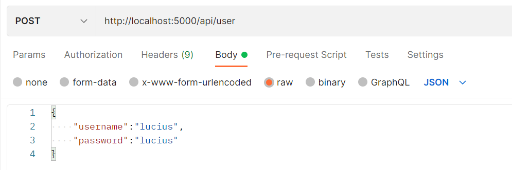
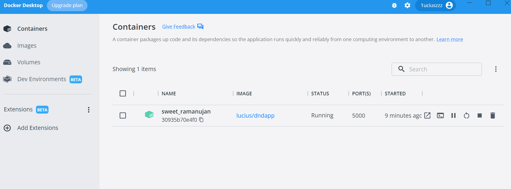

# dnd-task-app

demo for interview

## usage

```sh
cd backend
docker build -t lucius/dndapp:1.0 .
docker run -p <image id>
```

in frontend folder,

```sh
npm i
npm run dev
```

first use postman send a POST request to http://localhost:5000/api/user for register a account

datatype:json

data:

```json
{
  "username": "lucius",
  "password": "lucius"
}
```

for example:



then signin with account:
username:`lucius`
password:`lucius`

## highlights

1. in backend project, i write my own middleware for auth router.
2. redux but without redux-saga😭
3. docker deploy backend service
   

## video


